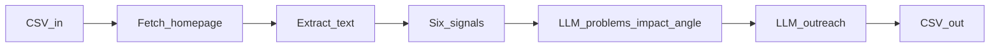

# Final: Lead Output Engine (Not a Product)

This is the **final** simplified plan: sharper signals, tighter analysis chain, higher-converting copy rules, and one clear output table including **Angle**.

---

## 1. FINAL SYSTEM OVERVIEW

**What it does**  
You feed a CSV of `business_name` + `website_url`. A **single Python script** fetches each homepage, extracts readable text, runs **six cheap checks** tuned to **money leaks** (missed bookings, slow response, bad intake), then calls the LLM twice: first to lock **1–2 real problems + impact + a one-line angle**, second to write a **short, human message** you can paste and send.

**Why it works**  
Owners respond to **specific observations** tied to **lost customers or wasted time**, not to “AI” or “optimization.” The script forces **evidence first** (signals + excerpt), so the model has something real to point at.

**Why it is optimized for clients fast**  
Same day you can batch **dozens of drafts**; your only job is **quick human QC** (30–60 seconds per row) and **send**. No CRM, no UI, no hosting.

---

## 2. FINAL SIGNAL SET (REVENUE / CONVERSION ONLY)

**Rule:** signals answer “where is money or time leaking on the path to a customer?”  
**Dropped:** viewport, HTTPS, stack trivia—owners do not care in a cold DM and they invite nitpicky debates.

| # | Signal name | What it detects (implementation hint) | Why it matters (business terms) |
|---|-------------|------------------------------------------|----------------------------------|
| 1 | **`no_booking_system`** | No common booking/embed patterns in HTML/text (e.g. calendly, cal.com, booksy, fresha, mindbody, square appointments, setmore, youcanbook.me, `book now` deep-linked widget hosts). | People ready to buy **bounce** when scheduling is unclear; calendar fills slower; **fewer booked jobs**. |
| 2 | **`call_only_intake`** | Prominent phone/voicemail language (“call to schedule”, “call us”, “leave a message”) **and** no booking + no short quote/contact form (or form is buried). | Calls stack up, after-hours leads **die**, front desk becomes a **bottleneck**. |
| 3 | **`no_instant_response`** | No chat widget markers (intercom, drift, crisp, tawk, zendesk messaging, hubspot chat, facebook messenger embed) **and** no “text us”, SMS, or “we respond in X minutes” style promise in hero/footer. | Hot leads cool off; **first responder wins** in local services. |
| 4 | **`weak_or_unclear_cta`** | Page has text but **no clear primary action** in first screen of extracted text: missing strong verbs tied to revenue (`book`, `get a quote`, `schedule`, `request`, `call now` near top) **or** multiple competing CTAs with no obvious “do this first”. | Visitors **stall**; fewer become appointments or quotes. |
| 5 | **`clunky_or_long_form`** | A `<form>` exists with **many fields** (e.g. >6) and/or `captcha` / long “tell us everything” copy. | Each extra field **kills completion**; fewer inbound leads per visitor. |
| 6 | **`weak_lead_capture`** | Lead capture is basically **newsletter/social only** (“subscribe”, “follow us”) without a clear **book / quote / contact** path in the first chunk of page text. | Traffic does not turn into **actionable leads**—just passive audience. |

**Optional 7–8 (only if easy and stable)**  
| 7 | **`manual_scheduling_language`** | Regex on visible text: “call to schedule”, “availability by phone”, “we will call you back”, “voicemail”, “during business hours only”. | Signals **after-hours leakage** and slower booking cycles. |
| 8 | **`high_friction_contact_path`** | Contact exists but path is indirect (must hunt footer, multiple pages, or “email us” as only path) **without** booking. | **Drop-off** between intent and contact. |

**MVP recommendation:** implement **1–6** first; add 7–8 if you see false negatives.

---

## 3. ANALYSIS LOGIC (SIMPLE BUT SMART)

**Per business, in code + LLM:**

1. **Detect signals** on HTML + first ~10–15k chars of visible text (store `signals_json` + 1 short evidence string per fired signal: substring match or “booking link absent + CTA text sample”).  
2. **Rank problems (deterministic pre-pass):** assign a simple priority stack when multiple signals fire:  
   - `call_only_intake` + `no_booking_system` → strongest (direct revenue leak)  
   - `clunky_or_long_form` + `weak_or_unclear_cta` → strong (conversion leak)  
   - `no_instant_response` → strong when paired with booking friction  
   - `weak_lead_capture` → medium (funnel leak)  
3. **LLM job:** pick **1 primary problem**, optional **second** only if it is clearly distinct (e.g. “no booking” + “long intake form” are two different leaks).  
4. **Chain of thought for the model (explicit in prompt):**  
   - **X:** what we saw (signal + plain-English observation from excerpt)  
   - **Y:** what that usually causes for a business like this (no fake stats)  
   - **Z:** what it costs (time, leads, bookings)—**one sentence**  

**Output feel:** “I noticed **[X on the site]** → that usually means **[Y]** → which hits **[Z]**.”  
If signals are weak and excerpt is thin: **do not force a problem**—mark row `needs_manual` and skip outreach LLM.

---

## 4. LLM PROMPTS (FINAL)

### PROMPT 1 — Website → Problems + Impact + Angle (JSON only)

**System**

You turn website evidence into sales insight. You only use the provided excerpt and signal flags. If evidence is thin, return empty problems and explain briefly. Never invent numbers, rankings, tools not shown, or internal company facts. Output **valid JSON only**.

**User**

business_name: {{business_name}}  
website_url: {{website_url}}  
extracted_text_excerpt: {{text_excerpt}}  
signal_flags: {{signals_json}}

Return JSON exactly in this shape:
{
  "chain": {
    "noticed": "one sentence: what on the site suggests the issue (plain English)",
    "likely_means": "one sentence: what that usually causes for customers (no stats)",
    "costs": "one sentence: business cost in time/leads/bookings (no numbers unless provided)"
  },
  "problems": [
    {
      "title": "short label, max 8 words",
      "explanation": "one sentence",
      "impact": "one sentence tying to leads/time/bookings/revenue risk"
    }
  ],
  "angle": "short hook, max 12 words, like a human would say it",
  "confidence": "high|medium|low",
  "notes": "optional, max 1 sentence"
}

Rules:
- Max **2** items in `problems`. If two, they must be clearly different leaks.
- If confidence is low: `problems` must be [] and `angle` must be "".
- `angle` must match the **primary** problem (problems[0]).

---

### PROMPT 2 — Outreach Message (HIGH-CONVERTING)

**System**

You write cold outreach like a normal business owner texting another owner: direct, friendly, zero corporate speak.

**Banned words (do not use any):** optimize, leverage, streamline, enhance, synergy, cutting-edge, solutions, ecosystem, transformational, touch base, hop on a call, pick your brain, circling back, hope you are well.

**Style:** {{style}}

Allowed styles:
- `direct`: blunt but polite, shortest sentences  
- `curious`: more questions-forward, still not salesy  
- `neighbor`: warm local-business tone, still professional  

**Hard rules:**
- 3–6 sentences total  
- 1 specific observation (must reference something from `noticed` or `signals`)  
- 1 simple insight (what that observation tends to mean for customers)  
- End with **exactly one** question  
- No paragraph walls  
- No “I used AI” / no claiming audits/tests unless provided  
- No fake personalization (no “I saw you just hired…”)

**User**

business_name: {{business_name}}  
website_url: {{website_url}}  
noticed: {{chain.noticed}}  
likely_means: {{chain.likely_means}}  
costs: {{chain.costs}}  
primary_problem_title: {{problems_0_title}}  
primary_impact: {{problems_0_impact}}  
angle: {{angle}}

Write the message. Output **only** the message text.

**How to get 2–3 variations:** run Prompt 2 three times with `style` = `direct`, then `curious`, then `neighbor` (store best column or three columns `message_direct`, `message_curious`, `message_neighbor`). Pick one default for sending (recommend **`direct`** for cold email, **`neighbor`** for local SMB DMs).

---

## 5. OUTPUT FORMAT (FINAL)

**Primary artifact:** one `out.csv` you open in Excel/Sheets.

| Column | What it is |
|--------|------------|
| **Business** | `business_name` from input |
| **Website** | canonical URL you fetched |
| **Problem** | Primary problem: `problems[0].title` + optional `; ` + `problems[1].title` if exists |
| **Impact** | `problems[0].impact` (and optionally second impact in same cell separated by ` \| ` if two problems) |
| **Angle** | One-line hook, e.g. “after-hours leads vanish if it’s phone-only” — from JSON `angle` |
| **Message** | Best single outreach (your pick of style, or default `message_direct`) |
| **Message_alt_A** | Optional: second style |
| **Message_alt_B** | Optional: third style |
| **Confidence** | high / medium / low |
| **Signals** | compact JSON or semicolon string for your own QA |
| **Notes** | fetch errors, `needs_manual`, model notes |

**Example (illustrative, not real data)**

| Business | Website | Problem | Impact | Angle | Message |
|----------|---------|-----------|--------|-------|---------|
| Apex HVAC | https://apexhvac.example | No online booking; call-only scheduling | After-hours callers bail; fewer booked visits per week | phone-only = leads cool off | Apex — quick one. On your site it looks like scheduling is mostly by phone… |

---

## 6. IMPLEMENTATION (SUPER SIMPLE)

**Stack:** one **Python file** (or two: `run.py` + `signals.py`), run locally.

**Libs (minimal):** `requests`, `beautifulsoup4`, `python-dotenv`, `openai` (official SDK). No FastAPI, no DB, no queue.

**Steps**

1. Load `leads.csv` (`business_name`, `website_url`).  
2. Fetch site: timeouts, follow redirects, cap bytes, polite User-Agent.  
3. Extract text: strip scripts/styles; keep title + meta description + body text; truncate.  
4. Compute **six signals**; build `signals_json` + evidence snippets.  
5. If `confidence_precheck` fails (e.g. almost no text): write row with empty Problem/Message, `Notes=INSUFFICIENT_DATA`, skip LLM.  
6. Else: **Prompt 1** → parse JSON (retry once on parse fail).  
7. If `problems` empty: skip Prompt 2.  
8. Else: **Prompt 2** up to **3** times for style variants (or parallel if you want speed—optional).  
9. Append CSV row; **flush** after each business.

**Operational knobs (CLI flags, not “infra”):** `--limit`, `--offset`, `--resume`, `--styles one|three`.

---

## 7. FINAL TONE + QUALITY RULES

- **Never sound robotic:** short sentences, contractions allowed, no template stack (“I came across your website”).  
- **Never make up facts:** only claims tied to excerpt/signals; if unsure, fewer claims beat a clever lie.  
- **Prefer simple wording:** 5th-grade reading level wins.  
- **Always tie problem → business impact** in Prompt 1; Prompt 2 should echo **one** impact, not a lecture.  
- **Clarity over intelligence:** one observation, one insight, one question.  
- **Angle is mandatory when sending:** if Angle feels weak, rewrite manually or rerun with a shorter excerpt focused on hero section.  
- **Human QC before send:** if `confidence` != high, read twice before sending.

---

## 8. FINAL VERSION (WHAT YOU SHOULD BUILD)

**Build exactly:** `run_leads.py` + `prompts` as strings or `.txt` files + `leads.csv` → `out.csv`.  
**Tools:** Python 3.11+, `requests`, `beautifulsoup4`, `python-dotenv`, OpenAI API (or Anthropic—pick one, do not build both).  
**Ignore for now:** dashboards, CRM, scoring engines, enrichment vendors, agents, Postgres, hosting, “productization.”  
**How this gets clients fast:** each row is a **sendable hypothesis** with a **hook (Angle)** and a **message**—you spend time **in inboxes**, not maintaining software.

**3-day execution (unchanged intent):** Day 1 signals+fetch; Day 2 both prompts+CSV; Day 3 real batch+prompt tweaks until messages sound human.

---

## Archive note

The older “internal SaaS / scoring / CRM” plan is **obsolete**. This document is the source of truth.
